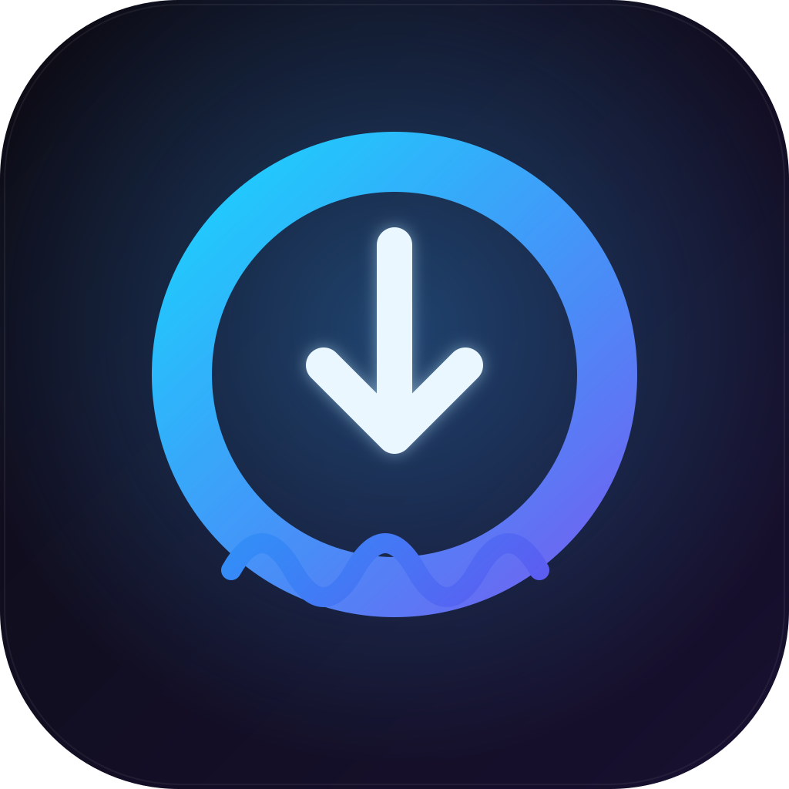

<div align="center">
  
  <h1>Tiddlui</h1>
  <p><b>A glassmorphic desktop downloader for Tidal</b><br/>
  Search · paste links · seekable waveform player · queue &amp; history · 9 themes</p>

  <p>
    
    
    
    
    
  </p>
</div>

Built on the open-source [`tiddl`](https://github.com/oskvr37/tiddl) downloader, wrapped in a
Tauri + SvelteKit shell with a Raycast-inspired UX.

> **For personal use only.** This downloads from *your own* paid Tidal account. You are
> responsible for complying with Tidal's Terms of Service and your local copyright laws.
> Not affiliated with Tidal.

---

## ✨ Features

- **🔎 Unified search / link bar** — type to search Tidal, or paste a track/album/playlist/
  artist/mix link to load it instantly.
- **🎚 Quality** — `LOW` (96 kbps) · `NORMAL` (320 kbps) · `HIGH` (16-bit FLAC) · `MAX`
  (up to 24-bit Hi-Res).
- **🌊 Waveform player** — finished tracks load into a player whose **waveform is the seek bar**
  (filled played area, draggable playhead).
- **🎴 Metadata panel** — cover art, rich track details, album/playlist track listings, and a
  one-click **Download all**.
- **📥 Queue & history** — live per-track + overall progress, cancel, re-download,
  reveal-in-folder, duplicate prevention.
- **🗂 Output templates** — e.g. `{album.artist}/{album.title}/{item.title}`, with a live preview
  and an optional per-track subfolder toggle.
- **🎨 9 themes** — Aurora · Obsidian (OLED) · Slate · Nebula · Aqua · Verdant · Mercury ·
  Tangerine · Paper.
- **⌨️ Shortcuts** — `Ctrl/⌘+K` search · `Enter` download · `Ctrl/⌘+,` settings ·
  `Ctrl/⌘+H` queue · `Ctrl/⌘+Q` quit. Plus drag-and-drop links onto the window.

## 🏗 Architecture

```
SvelteKit (Svelte 5 · Tailwind v4 · shadcn-svelte)    ← UI
        │  Tauri commands / events
Rust (Tauri 2)                                         ← window, IPC bridge, config
        │  line-delimited JSON over stdio
Python engine (PyInstaller sidecar · wraps tiddl.core) ← auth, search, downloads
```

The download engine is a small Python program (`sidecar/`) that wraps `tiddl.core` and speaks a
line-delimited JSON protocol over stdio. Rust spawns it as a bundled Tauri *sidecar* and relays its
events to the UI.

## ⬇️ Install (end users)

Grab the latest installer (`Tiddlui_x.y.z_x64-setup.exe`) from the [Releases](../../releases) page,
run it, and launch **Tiddlui**. On first start it prompts you to sign in to Tidal (a short code +
link). That's it.

> Needs `ffmpeg`; if it isn't already on your system the app fetches a copy on first run.

## 🔧 Build from source

**Prerequisites:** Node 20+, [Rust](https://rustup.rs) (+ MSVC build tools & WebView2 on Windows),
Python ≥ 3.13 (to build the sidecar), and `ffmpeg`.

```bash
# 1. Frontend deps
npm install

# 2. Build the engine sidecar (in a Python 3.13 environment)
cd sidecar
pip install -r requirements.txt
./build.ps1          # → src-tauri/binaries/tiddl-engine-<target-triple>.exe
cd ..

# 3. Run in dev …
npm run tauri dev
# … or build the installer
npm run tauri build
```

The sidecar binary is a git-ignored build artifact — run `sidecar/build.ps1` after cloning or
whenever you change the engine. (`assets/logo.svg` is the source for the app icons; regenerate with
`npm run tauri icon assets/logo.png`.)

## 🔐 Security

- Auth tokens live in the **OS keychain** (Windows Credential Manager via `keyring`) — never in
  plaintext. Any legacy `~/.tiddl-gui/auth.json` is migrated into the keychain and deleted on first
  launch.
- The webview reads local media only within a scoped set of directories (asset protocol), talks to
  the engine exclusively over stdio (no arbitrary command execution), and runs under a restrictive
  Content-Security-Policy.

## 📦 Credits & license

- This project: **MIT** — see [LICENSE](./LICENSE). Created by **@czgabi**.
- [`tiddl`](https://github.com/oskvr37/tiddl) — Apache-2.0, bundled in the engine.
- [Tauri](https://tauri.app) · [SvelteKit](https://svelte.dev) ·
  [shadcn-svelte](https://shadcn-svelte.com) · [Tailwind CSS](https://tailwindcss.com) ·
  [Lucide](https://lucide.dev) · [ffmpeg](https://ffmpeg.org).
