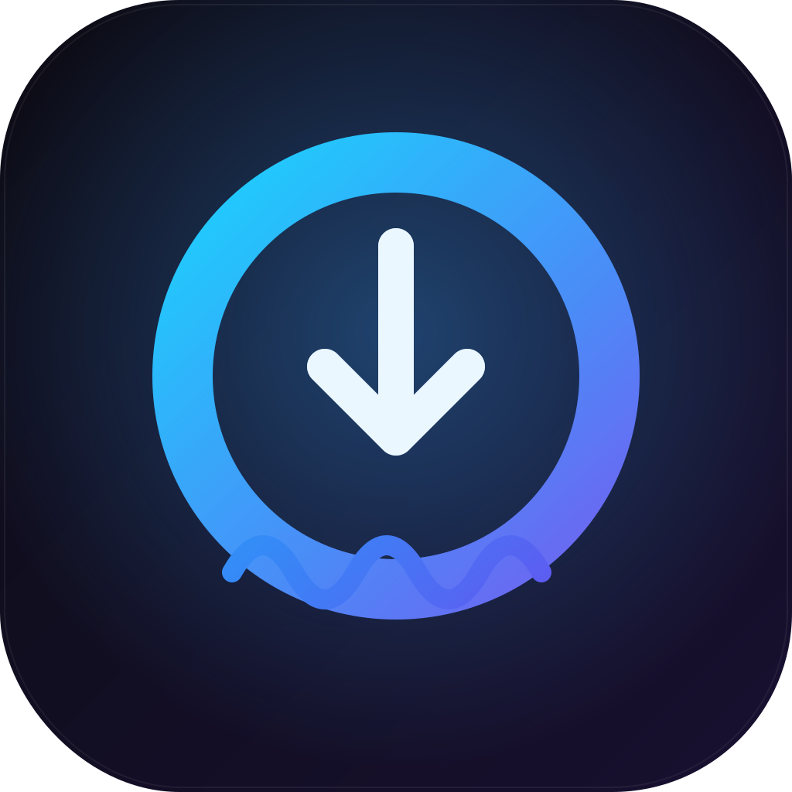

<div align="center">
  
</div>

Desktop app to download from Tidal. Search or paste a link, pick a quality, download. Windows.

## Install

Download `Tiddlui_x.y.z_x64-setup.exe` from [Releases](../../releases), run it, sign in to Tidal.
(ffmpeg is fetched automatically if you don't already have it.)

## Features

- Search Tidal, or paste track / album / playlist / artist links
- Quality: Low · Normal · High (FLAC) · Max (Hi-Res)
- Waveform player you can scrub
- Queue + history, album "Download all", duplicate prevention
- Output templates, optional per-track subfolders
- 9 themes, keyboard shortcuts, drag & drop

## Build from source

Needs Node 20+, Rust, Python 3.13 and ffmpeg.

```bash
npm install
cd sidecar && pip install -r requirements.txt && ./build.ps1 && cd ..
npm run tauri dev          # or: npm run tauri build
```

The engine (`sidecar/`) is a Python program wrapping [`tiddl`](https://github.com/oskvr37/tiddl),
run as a Tauri sidecar. Auth tokens are kept in the Windows keychain, not in plaintext.

## Notes

For personal use with your own Tidal account. Built on `tiddl` (Apache-2.0). MIT licensed.
