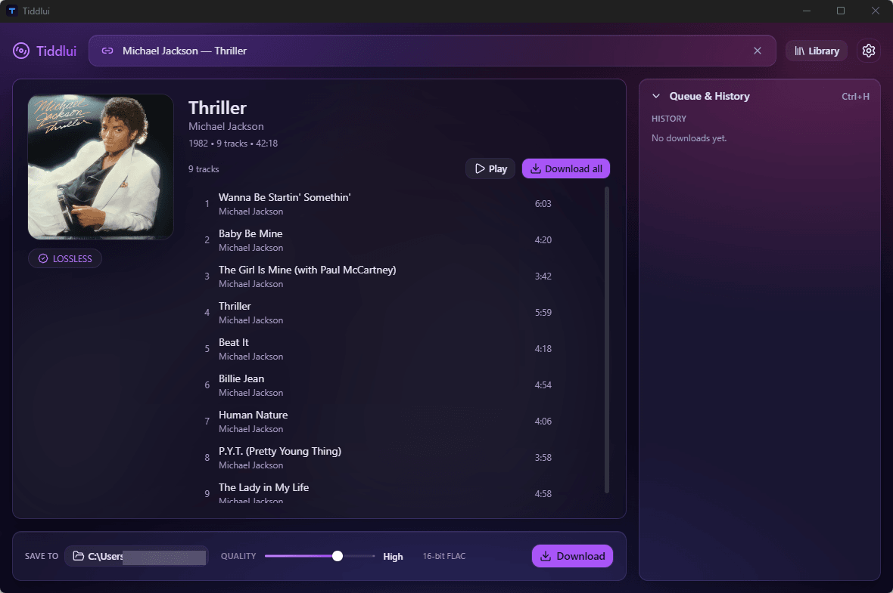
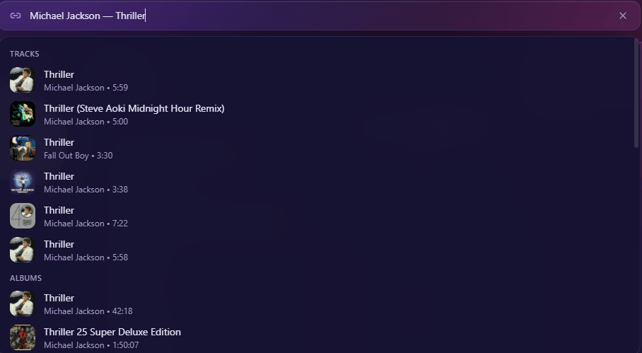
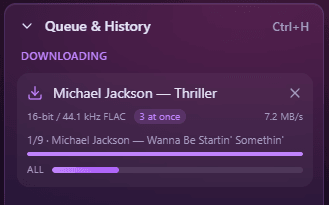

<div align="center">


**A desktop app for downloading your Tidal music in lossless quality.**
Search it, preview it, download it — no command line needed.



</div>

---

## What it does

- Search Tidal, or paste any track / album / playlist / artist link
- Download in up to 24-bit Hi-Res, or plain MP3 if you prefer small files
- Preview any track before you commit to downloading it
- Browse your own Tidal favourites without opening Tidal
- Keeps your files named and foldered the way you want them

Runs on Windows and Linux.

---

## Install

You need your own Tidal subscription. Quality is capped by your plan, and you
sign in on Tidal's own website — Tiddlui never sees your password.

### Windows

Download **`Tiddlui_x.y.z_x64-setup.exe`** from [Releases](../../releases), run
it, then click **Sign in**.

ffmpeg is required to convert audio. If you don't already have it, Tiddlui
downloads it automatically on first launch — you'll see a short
"Preparing ffmpeg…" banner.

### Arch Linux

```bash
yay -S tiddlui        # or: paru -S tiddlui
```

> **Not on the AUR yet.** The `PKGBUILD` lives in [`packaging/aur/`](packaging/aur/)
> and has to be published by a maintainer after a release is tagged — see
> [`docs/PACKAGING.md`](docs/PACKAGING.md). Until then, build from source.

### Debian / Ubuntu

```bash
sudo apt install ./Tiddlui_x.y.z_amd64.deb
sudo apt install ffmpeg          # required, not bundled on Linux
```

A distro-agnostic `.AppImage` is attached to every release too.

> On Linux, ffmpeg comes from your package manager and auth tokens are stored
> through the Secret Service API. See [`docs/LINUX.md`](docs/LINUX.md) for
> runtime notes on Wayland, keyring and audio codecs.

---

## Your first download



1. **Find something.** Type in the search bar (`Ctrl+K`), or paste a Tidal link.
2. **Pick a quality** with the slider at the bottom.
3. **Hit Download.** For an album, use **Download all**.

Progress shows in the **Queue & History** panel on the right (`Ctrl+H`).

---

## Features

### Search and browse

Search returns tracks, albums, playlists and artists at once. Results are ranked
by how well they match *and* how popular they are, so the obvious answer comes
first — and near-misses still work ("avici levels" finds Avicii).

Click an artist to see their bio, top tracks and full discography. Click any
album to drill in; the back arrow returns you.

### Preview before downloading

Hit **Preview** on a track to stream it straight from Tidal. Nothing is written
to disk. The seek bar draws a real waveform of the track, and **Play** on an
album or playlist plays the whole thing in order.

### Quality

| Setting | What you get |
| --- | --- |
| Low | 96 kbps AAC |
| Normal | 320 kbps AAC |
| High | 16-bit FLAC (CD quality) |
| Max | Up to 24-bit Hi-Res FLAC |

Turn on **Convert to MP3** in Settings to also get a 320 kbps MP3 — useful for
car stereos and older players. Tags and cover art carry across.

### Downloads, queue and retry



Albums and playlists download several tracks at once — 3 by default, adjustable
from 1 to 5. The queue shows combined speed and the real quality of each file.

- **The queue survives a restart.** Close the app mid-download and it comes back
  marked as interrupted, ready to retry.
- **Retry what failed.** One track failing in a 40-track album no longer loses
  it silently — the row shows how many failed, and one click re-queues just
  those tracks.
- **Duplicates ask first.** If a file already exists you can skip, replace or
  keep both, and apply that choice to the rest of the album.

### Your Tidal library

**Library** opens your Tidal favourites — tracks, albums, artists and playlists —
so you can download things you already saved without hunting for links.

### The player


Finished downloads load into the player automatically. You get a seekable
waveform drawn from the actual audio, a volume slider that appears when you
hover the speaker, and click-anywhere scrubbing.

### Themes


Twelve themes, five dark and seven light. The flagship is **Aero** — a
liquid-glass look with a refractive rim that shifts as you hover. There's also
Aurora, Obsidian, Slate, Nebula, Artsy, Cream, Aqua, Verdant, Mercury,
Tangerine and Paper.

---

## Settings


| Setting | What it does |
| --- | --- |
| Download folder | Where files are saved. You can also drag a folder onto the window. |
| Filename template | How files are named and foldered — see below |
| Subfolder for each track | Single tracks get their own folder (albums always do) |
| Convert to MP3 | Also produce a 320 kbps MP3 |
| Start muted | Begin every session muted; volume still starts at max |
| Simultaneous downloads | Tracks fetched at once (1–5). Higher is faster, but Tidal may throttle heavy use. |
| Theme | Twelve looks, applied instantly |
| Notify when downloads finish | Desktop notification and a taskbar flash |

### Keyboard shortcuts

| Keys | Action |
| --- | --- |
| `Ctrl+K` | Focus search |
| `Enter` | Start the download |
| `Ctrl+H` | Show/hide queue and history |
| `Ctrl+,` | Settings |
| `Ctrl+Q` | Quit |

---

## Where your files go

The filename template decides the folder structure. `/` makes a folder.

```
{album.artist}/{album.title}/{item.number:02d}. {item.title}
→  Daft Punk/Discovery/01. One More Time.flac
```

| Token | Value |
| --- | --- |
| `{album.artist}` | Album artist |
| `{album.title}` | Album title |
| `{item.title}` | Track title |
| `{item.artist}` | Track artist |
| `{item.number}` | Track number — pad it with `{item.number:02d}` |
| `{playlist.title}` | Playlist name |
| `{playlist.index}` | Position in the playlist |

Settings shows a live preview of the result as you type.

---

## Build from source

You need **Node 20+**, **Rust**, **Python 3.13+** and **ffmpeg**.
[`docs/BUILD.md`](docs/BUILD.md) has the full walkthrough including per-distro
dependency lists.

```bash
npm install
```

Then build the Python engine into the executable Tauri bundles as a sidecar. A
virtualenv is recommended — Python 3.13+ is required and many systems refuse
global installs:

```bash
cd sidecar
python -m venv .venv

# Windows
.venv/Scripts/pip install -r requirements.txt
.venv/Scripts/Activate.ps1 && ./build.ps1

# Linux / macOS
.venv/bin/pip install -r requirements.txt
bash build.sh

cd ..
```

Then run or package the app:

```bash
npm run tauri dev      # hot-reloading dev window
npm run tauri build    # installer in src-tauri/target/release/bundle
```

The engine is a compiled binary, so **changes to `sidecar/*.py` need the build
script re-run and the app restarted.** Frontend changes hot-reload.

Releases are automated: push a `vX.Y.Z` tag and CI builds the Windows installer
and the Linux `.deb` + `.AppImage`, stamps the version into `package.json` and
`tauri.conf.json`, and attaches the notes from `CHANGELOG.md` to the GitHub
Release. Packaging details are in [`docs/PACKAGING.md`](docs/PACKAGING.md).

---

## How it works

Three layers, each doing one job:

```
┌─────────────────────────────────────────────────────┐
│  WebView — SvelteKit + Svelte 5 runes, Tailwind v4  │
│  UI, player, waveform rendering, all app state      │
└───────────────────────┬─────────────────────────────┘
                        │  Tauri commands  /  events
┌───────────────────────┴─────────────────────────────┐
│  Rust — Tauri 2                                     │
│  window, settings.json + queue.json, sidecar bridge │
└───────────────────────┬─────────────────────────────┘
                        │  line-delimited JSON over stdio
┌───────────────────────┴─────────────────────────────┐
│  Python engine — wraps tiddl.core                   │
│  auth, search, resolve, download, ffmpeg, waveforms │
└─────────────────────────────────────────────────────┘
```

The frontend never talks to Tidal. It sends a command object to Rust, Rust
writes it as one JSON line to the engine's stdin, and every line the engine
writes to stdout is parsed and re-emitted as an `engine` event the frontend
routes by its `type` field. That keeps the Rust layer stable no matter how the
protocol grows — it forwards messages without understanding them.

Downloads are grouped: one queue entry ("an album") expands to many tracks. The
engine reports progress at the group level as
`(finished + sum of the running tracks' fractions) / total`, throttled to one
event every ~120 ms so extra parallel workers don't multiply the traffic.

On Linux, playback takes a detour: WebKitGTK's GStreamer pipeline refuses
Tauri's `asset://` scheme and chokes on large `blob:` URLs, so downloaded files
are served to the `<audio>` element from a loopback HTTP server with range
support. See [`docs/LINUX.md`](docs/LINUX.md).

**Why a separate Python process?** [`tiddl`](https://github.com/oskvr37/tiddl)
does the hard part — Tidal's API, stream manifests, tagging. Running it as a
sidecar means we use it as-is rather than reimplementing it in Rust.

### Project layout

```
src/                 SvelteKit frontend
  lib/components/    UI (metadata panel, queue, player, dialogs)
  lib/stores/        app state — downloads, player, settings, search, auth
  lib/ipc/           command wrappers + the engine event router
  app.css            design tokens and all twelve themes
src-tauri/src/       Rust — sidecar bridge, settings/queue persistence,
                     Linux audio server
sidecar/             Python engine
  engine.py          command loop, download worker, progress aggregation
  resolver.py        search, ranking, URL resolution, waveform peaks
  downloader.py      one track: fetch, extract, tag, optional MP3
  session.py         auth and token storage
docs/                build, Linux runtime and packaging guides
packaging/aur/       PKGBUILD and desktop entry for the AUR
```

---

## Privacy and security

- **Login uses Tidal's device flow.** You authenticate on Tidal's own site;
  the app never sees your password.
- **Tokens live in the OS keychain** — Windows Credential Manager, or the Secret
  Service on Linux — never in a plaintext file. Signing out deletes them.
- **No accounts, keys or telemetry** ship with the app. It talks to Tidal's API
  and, on Windows, downloads ffmpeg on first launch.
- Settings and your queue are stored as plain JSON in the app config folder.
  They contain titles and file paths, no credentials.

Found a security issue? See [SECURITY.md](SECURITY.md).

---

## Troubleshooting

**"Preparing ffmpeg…" never finishes.** Check your connection, then restart. If
it keeps failing, install ffmpeg yourself and make sure it's on your `PATH`. On
Linux, install it with your package manager.

**A download failed.** Hover the history row and hit the retry arrow. If a whole
album failed, check you're still signed in.

**Downloads are slow, or lots of tracks fail.** Lower **Simultaneous downloads**
in Settings. Tidal may throttle aggressive fetching.

**Quality is lower than expected.** Hi-Res needs a plan that includes it; the
queue row shows the quality you actually got.

**Linux: no audio, or glass panels look transparent.** Both are known WebKitGTK
quirks with documented workarounds — see [`docs/LINUX.md`](docs/LINUX.md).

---

## Credits

Built on [`tiddl`](https://github.com/oskvr37/tiddl) by oskvr37 (Apache-2.0),
which does all the real Tidal work. UI with [Tauri](https://tauri.app),
[Svelte](https://svelte.dev) and [Tailwind](https://tailwindcss.com).

MIT licensed. For personal use with your own Tidal account.
